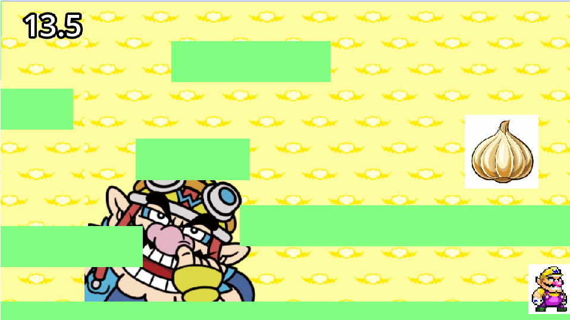

# MyFirstGame
Two minigames in one game. I replicated the WarioWare Game by following the guide. In first minigame, you have to move through obstacles to get to the garlic in 15 seconds. Movement controls are the arrow keys as of right now. In the second minigame, you have to click the garlics with your cursor.
## Play the Game
**[Play on itch.io](https://sparklydinosaur310.itch.io/myfirstgame)**
## Gameplay Preview

## About this Project
This is my first time coding a game. I used Godot to code this game and I learnt a lot over the span of 7 hours. Currently, there are only 2 minigames but I will continue to work on this project and soon, there will be 4 working minigames.
Thank you for reading this and I hope you enjoy my project!❤️(●'◡'●)
